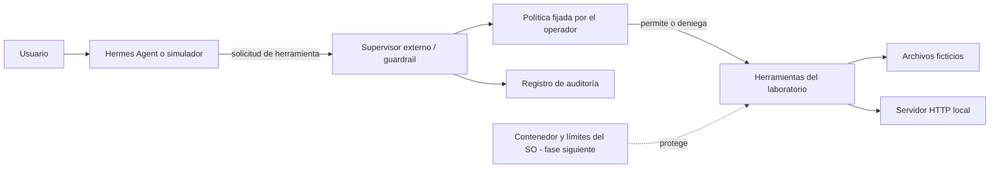

# FDSI-GP-02 | Aislamiento de herramientas de agentes

Proyecto académico de Fundamentos de Seguridad. Investigamos qué sucede cuando un agente puede usar herramientas para acceder a archivos, red y recursos, y qué cambia al colocar controles externos entre el agente y esas herramientas.

**Estado de esta entrega (26/09/2026):** funciona una demo local con agente simulado, supervisor de herramientas separado, políticas As-Is/To-Be para archivos y red, registro JSONL y un adaptador MCP experimental para Hermes Agent. La integración con una instancia real de Hermes y los límites del sistema operativo para tiempo, memoria y CPU siguen pendientes. No presentamos esos controles como resultados ya medidos.

## Pregunta e hipótesis

**Pregunta:** ¿En qué medida una política externa y el aislamiento de ejecución reducen las acciones no autorizadas de las herramientas de un agente, sin bloquear una lectura legítima?

**Hipótesis:** en To-Be se permitirá leer un archivo autorizado y se bloquearán la lectura de un archivo privado, la escritura y la solicitud de red. En una fase posterior, el contenedor deberá limitar tiempo, memoria y CPU. Se compararán las mismas entradas y métricas en ambos escenarios.

## Arquitectura



Hermes tiene mecanismos propios de aprobación y aislamiento, pero el experimento estudia por qué una decisión del modelo no equivale a una barrera de seguridad. La política del supervisor se fija fuera de los argumentos que el agente puede enviar. En la integración final, el agente tampoco deberá tener un camino alterno hacia los archivos, la red o el supervisor.

| Escenario | Comportamiento |
| --- | --- |
| As-Is | El supervisor permite leer el archivo privado, escribir en datos ficticios y contactar el servidor local. Es una línea base controlada, no una configuración recomendada. |
| To-Be | El supervisor solo permite leer `permitidos/nota.txt`. Deniega lectura privada, escritura y acceso HTTP. |
| Pendiente | El contenedor impondrá acceso al sistema de archivos, red deshabilitada y límites de tiempo, memoria y CPU. |

## Ejecutar la demo inicial

Requiere Python 3.10 o superior; no necesita paquetes externos ni credenciales.

```powershell
python src/demo.py
```

El script crea una copia temporal de los datos y compara las mismas cinco solicitudes en As-Is y To-Be. Muestra PERMITE/BLOQUEA y escribe el registro en `evidencias/demo.jsonl`. Las etiquetas D01-D05 corresponden a esta demostración corta; el plan completo T01-T05 se describe en [docs/PLAN_DEMO.md](docs/PLAN_DEMO.md).

Prueba del adaptador MCP con un cliente JSON-RPC de ejemplo:

```powershell
python -m unittest discover -s tests -v
```

## Hermes Agent

El profesor propuso usar Hermes Agent para que la demo muestre un agente real tomando decisiones. El adaptador `src/mcp_guardrail.py` expone la herramienta `laboratorio_controlado` mediante MCP por stdio. El modo To-Be es el valor predeterminado y se define en el proceso del servidor, fuera de los argumentos que el agente envía. La [guía de integración](docs/HERMES.md) explica el montaje propuesto y las barreras adicionales que debemos validar antes de afirmar que Hermes quedó aislado.

## Documentación

- [Investigación y mapa de riesgos](docs/INVESTIGACION.md)
- [Plan de demostración y métricas](docs/PLAN_DEMO.md)
- [Integración de Hermes y controles externos](docs/HERMES.md)
- [Referencias verificadas](docs/REFERENCIAS.md)
- [Avance y límites de esta entrega](docs/ESTADO.md)

## Alcance seguro

Solo se usan archivos ficticios dentro de `datos/` y un servicio que escucha en `127.0.0.1`. Las rutas fuera de la carpeta del laboratorio se deniegan incluso en As-Is. No hay secretos, datos personales ni acceso a sistemas de terceros.

## Uso de IA

Se utilizó ChatGPT (Codex) para organizar fuentes, redactar la documentación, crear los scripts y revisar las pruebas. El equipo debe validar el contenido y ejecutar la demo antes de presentarla. Las decisiones y resultados experimentales que faltan se declararán cuando existan.
